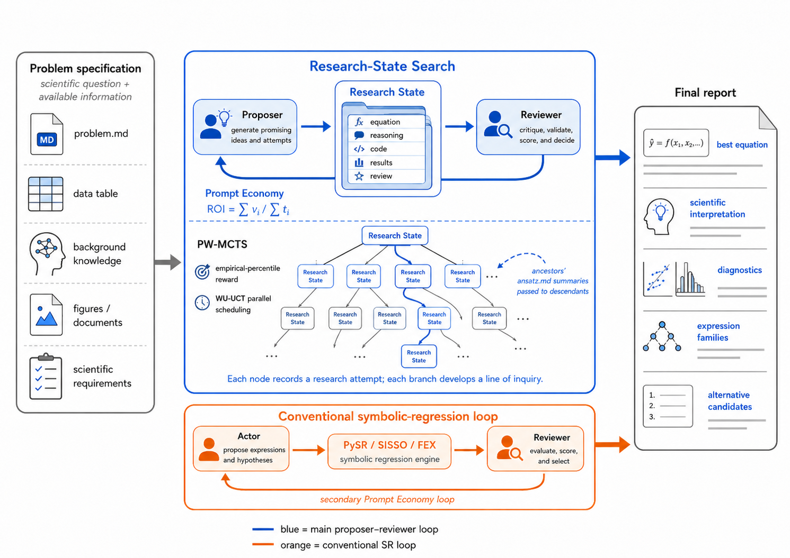

# AutoSR

[](https://autosr.app) [](https://arxiv.org/abs/2608.16876) [](https://claude.com/claude-code)

English | [中文](README_zh.md)

AutoSR ([paper](https://arxiv.org/abs/2608.16876)) is a Claude Code plugin for symbolic ansatz search.
AutoSR performs symbolic regression by searching through Research States, following the process of human scientific discovery.

## Use it directly on the web

Log in to [autosr.app](https://autosr.app) to get started!



## Start Claude Code as a plugin

Problems and generated artifacts live outside the plugin, usually in a problem workspace such as `artifacts/pile_efficiency/`.
The `artifacts/` directory is where problem workspaces go; only its README is tracked, so data, runs, and generated outputs stay local.

From a problem workspace:

```
cd /path/to/problem-workspace
claude --plugin-dir /path/to/AutoSR/agonsr --dangerously-skip-permissions
```

Then run `/llm-mcts 10 problem.md`.

Resume an existing run:

```
/llm-mcts 10 problem.md --resume runs/llm-mcts_YYMMDD_HHMM
```

### `problem.md`

`problem.md` should contain the actual problem definition: objective, variables, data/docs/scripts to read, constraints, evaluation method, scoring rubric, and expected `ansatz.md` contents. Use paths relative to the problem workspace.

### `IGNOREME.md`

Optional. Put special per-role notes here when they should not live in the general problem statement. Format:

```
## Notes to ansatz-proposer

## Notes to ansatz-reviewer

## Notes to dispatcher

```

The dispatcher reads this file and passes each section only to the corresponding subagent.

## Pipeline

`llm-mcts` is a dispatcher. It initializes or resumes a run, gets the next candidate from `mcts.py next`, sends fixed minimal prompts to `ansatz-proposer` and `ansatz-reviewer`, reads the `<review score="X">` block from `ansatz.md`, calls `mcts.py update`, and finally shows the best candidates.

Run files are written under `runs/`. See `agonsr/references/project_manual.md` for the exact workspace and ansatz-file conventions.

## Citation

```
@misc{zhang2026autosrautomaticsymbolicregression,
      title={AutoSR: Automatic Symbolic Regression by Searching Research States},
      author={Youran Sun and Kejia Zhang and Xinyu Ren and Chugang Yi and Haizhao Yang},
      year={2026},
      eprint={2608.16876},
      archivePrefix={arXiv},
      primaryClass={cs.SC},
      url={https://arxiv.org/abs/2608.16876},
}
```
